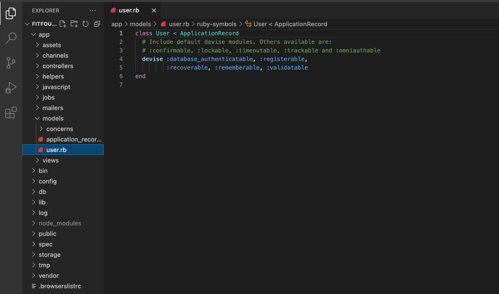
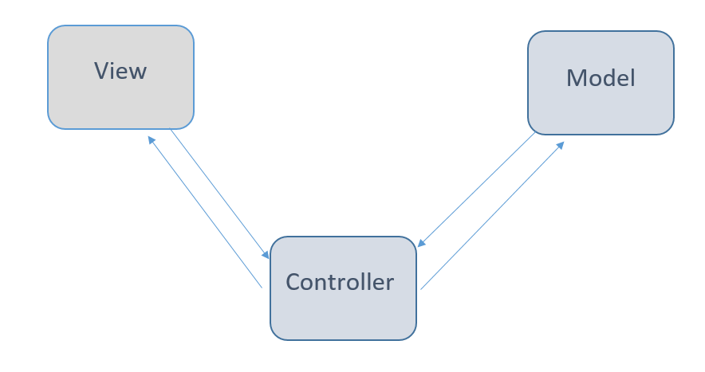
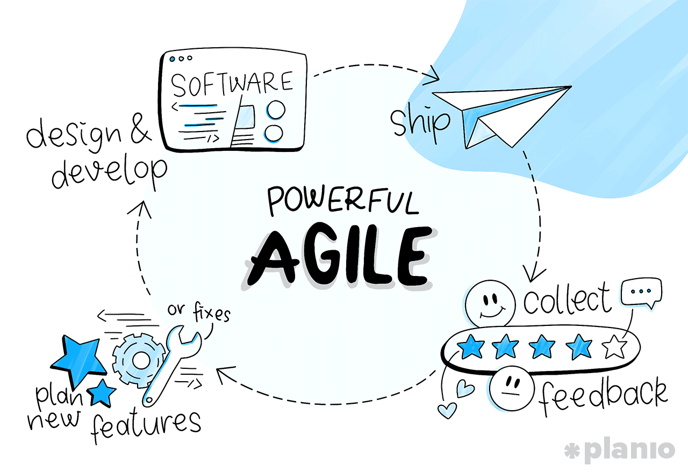
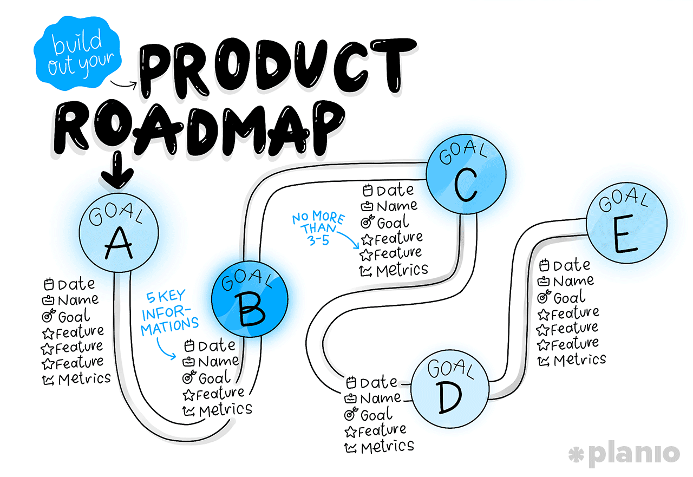
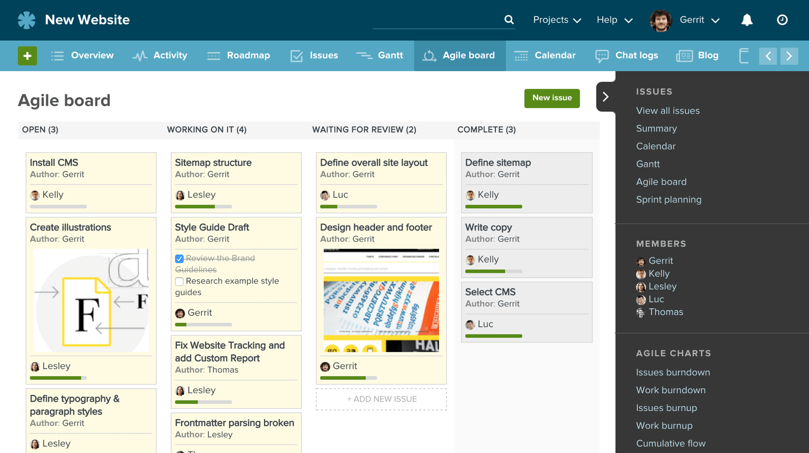
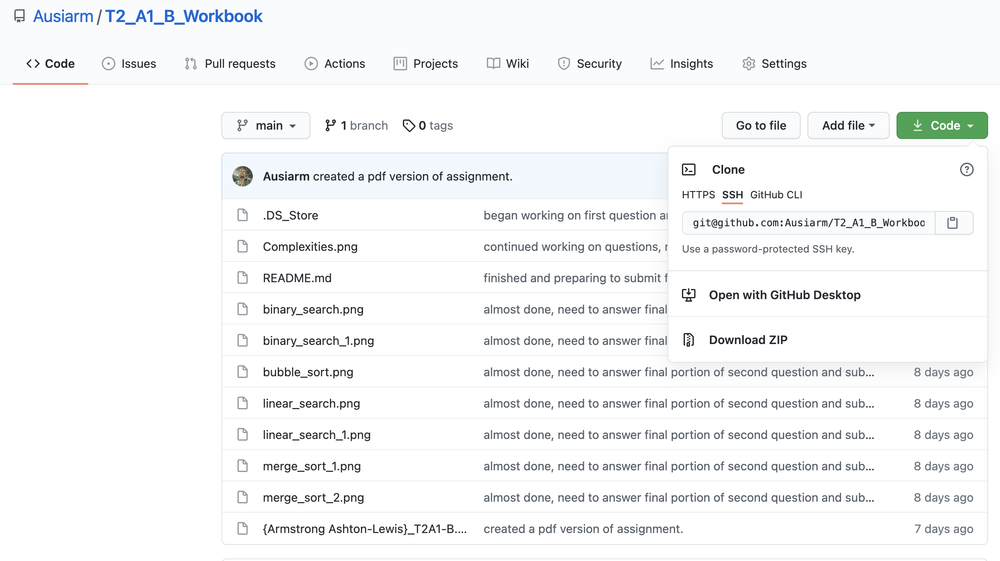
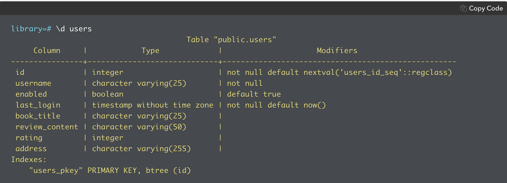
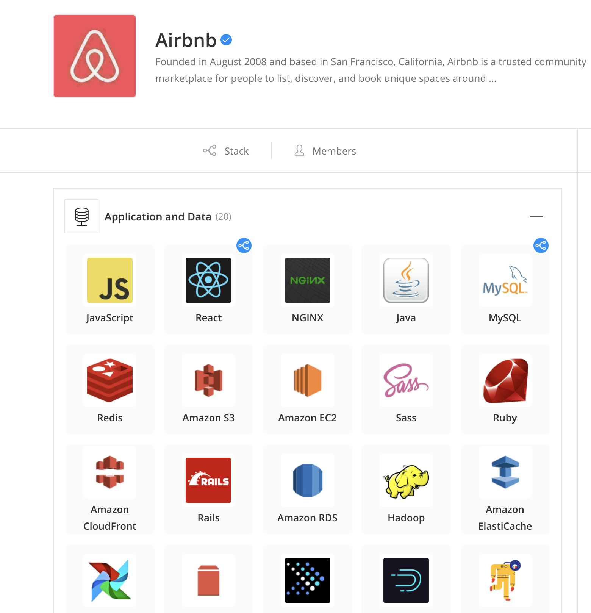
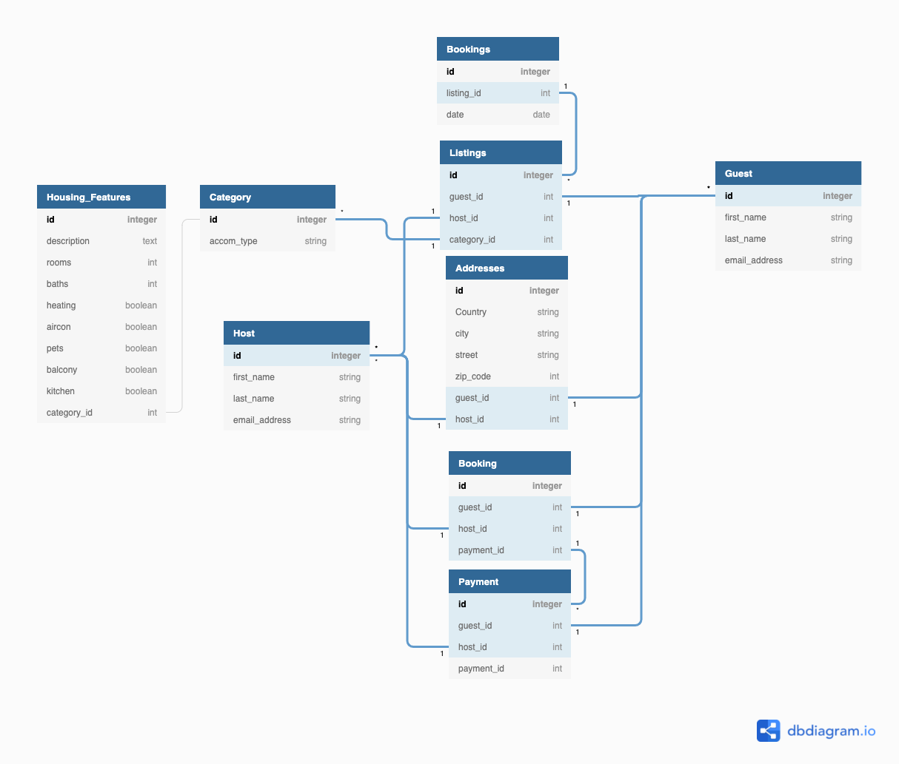

 # <div align="center"> T2A1_A_Workbook </div>

## Section 1 Architecture of a Rails Application
- The architecture of a typical rails application is a combination of the MVC architecture pattern infused with the convention over configuration or coding by convention standards. 
  - The convention over configuration standards protocol sets out what files must be included in a ruby on rails application. This structure is built into the base functionality of rails. A result of this built in functionality is when a new file is generated in the case of ``` rails g controller (controller name) ``` or ``` rails g model (model name) ```. These commands will always be produce the same type of file in the same location. Additionally, they are generated in the same way and located in the exact same location across any application, this constancy is what is referenced when talking about convention over configuration. Thanks to this convention, all aplications created in rails will have the same foundation and be able to be discussed and worked on by professionals who may not have been involved with their immediate creation.   
    - This is incredibly valuable in the workplace as it allows the developer to functionally bypass the setup processes of creation of an app by agreeing to a universal formatting system that can be implemented by generating an app through the rails commands (examples provided above). 
  - Within the above mentioned conventions, developers abide by the MVC architecture pattern for an application. This stands for the three elements that make it up; Models, Views, and Controllers. Models and Views never directly interact and instead pass information through the controller that links them. Further information on each of these constituent parts of the MVC pattern and where they are found in an app: 
    1. Model: The model both represents and manages the content/data in an application as well as defines the data structure and relationships of that content. In addition, it connects to the database and can retrieve and modify content while processing some validation of the data.
      - Command to generate a new model in the command line: ``` rails g model (model name) ```
      - After running the above command a model can be located in a rails app by navigating to the app folder then to the models folder and then by clicking on the specific model file within this folder.
      - Example of model location: 
    2. View: The view is the part of the application that concerns how information that is stored in the model is presented to the user. In addtion, the view is where user interacton functionality will be built into the application in the form of things such as buttons or links. All of this is only possible by connecting the applications views to the models through the use of controllers.
      - Unlike models and controllers, views are created by adding a html.erb file to the views folder of the application instead of running a rails g command. 
      - Views files can be found by navigating to the app folder, then to the views folder, and finally to the specific view file that is desired.
      - Example of view location: 
    3. Controller: As its name indicates, the controller is the part of a rails application that handles changeover and the job of connecting the model as the source of data with the view. This is then conveyed to the browser as the user endpoint of interaction with that data. When the user attempts to interact with data in the form of browser interaction it must be processed and passed through the controller before any data manipulation in the model can occur. 
      - Command to generate a new controller in the command line: ``` rails g controller (controller name) ```
      - After running the above command a controller can be located in a rails app by navigating to the app folder then to the controllers folder and then by clicking on the specific controller file within this folder.
      - Example of Controller location: 
  - This architecture pattern establishes a guiding ruleset that takes away the ambiguity of knowing where certain parts of logic should be coded in an application. This universalization of how to build an application is one of the main benefits of building an application in rails and can be further understood by visually understanding their relationship. Please see the attached photo:  
  - 

- [Source_1](https://ait.instructure.com/courses/3520/pages/mvc?module_item_id=272763)
- [Source_2](https://towardsdatascience.com/everything-you-need-to-know-about-mvc-architecture-3c827930b4c1)

## Section 2 Pros and Cons of a Commonly Used DBMS
- PostgreSQL is one of a few of the larger and more commonly used Database Management Systems (here on referenced as DBMS's) in the commercial sphere. It is the database that will be focused on below and is very commonly utilized when developing rails applications. PostgreSQL is a relational database which means that data objects or entities stored within are linked to a primary key and can be associated with other tables within the database. 
    - Advantages: 
      1. Open source: Unlike other large DBMS on the market, PostgreSQL is open source and free to the public. This open source foundation has aided with the uptake of postgreSQL across the developing world as amateurs and professionals can make use of it and support its continual evolution in order to keep up with the market.  
      2. PostgreSQL is supported across many platforms including mac, windows, and linux. This is beneficial as it means that it can be used and successively tested in multiple environments making PostgreSQL more robust and applicable for many different use cases rather than being bound to one native platform. 
        - This further enhances the second portion of advantage No. 1. 
      3. PostgreSQL's open source nature means that it has a constant source of user testing it which leads to regular updates, making it incredibly robust and long lived. 
      4. PostgreSQL is known in industry as being one of the most secure DBMS's for data integrity. Given that a DBMS is all about the storage of data, often times highly private data, this advantage is critical as a selling point and is often one of the main reasons to opt to use postgreSQL. 
      5. As far as rails is concerned, it is the industry standard for a paired DBMS even though rails natively includes SQLlite.
      6. Noted by Sébastien Derivaux, in his 2019 [article](https://dataintoresults.com/post/postgresql-for-data-science-pro-and-cons/), versions of PostgreSQL beyond 10.0 have the ability to utilize all cores of modern processors. This is incredibly valuable as it will reduce query time when working with databases. Time efficiency can become retarded by massive amounts of data in a database and so any form of advancement in this specific area should be highly sought after by companies seeking to find a worthwhile DBMS. 
    - Disadvantages:
      1. PostgreSQL does not compress data. This can become a problem when trying to load or move massive amounts of data into the DBMS as it will take a larger portion of time to process. Having reduced package sizes that can be ingested in a more time efficient manner is a huge benefit and, in the case of postgreSQL, may lead companies and users to look elsewhere for a DBMS.
        - With this in mind, databases of sizes greater than 100 GB should not be handled with postgreSQL due to this limitation. 
      2. Unfotunately, given that it is open source and not controlled by a single entitiy, it has a hard time keeping pace with other DBMS's such as MySQL or Oracle due to their controlled ability to pivot in relation to industry changes. 
      3. Due to its advantage of being highly compatible among many different languages, PostgreSQL loses out in relation to enhanced speed improvements when compared to something like MySQL which openly accepts its incompatability as a tradeoff for focusing on building a faster DBMS into the future. 
- With these pros and cons in mind it is safe to say that when operating with data packages smaller than 100 GB, postgreSQL is a great option and should be considered. Beyond this a user or company may be better suited looking for a DBMS that includes data compression functionality. 

## Section 3 Implementation of Agile Methodology in Projects
- At its core, the implementation of agile project management in the workplace involves a progressive and continuous feedback loop between customers and developers. This feedback loop can be seen below thanks to the easy to interpret version included in Jory Mackay's 2018 [article](https://plan.io/blog/what-is-agile-project-management/) on agile implementation: 
  - 
  - It allows customers who pay for the services of development teams to not only receive constant updates as to the status of their desired product but actual usable applications that can continuously grow based off the customers needs and desires in real time. This approach avoids the most obvious and painful pitfalls of the waterfall method (needing to commit resources entirely to a product that may not even match customer needs). While it is true that the waterfall method dominated the early ecosphere of professional IT services, it has, and is proving to be too rigid for the future of collaborative working. This is due to requirements placed on the customer to have an understanding of future needs that cannot possibly be fully understood until they come into being in the present. This leads to burnout both on the part of the developer and the customer as the developer sets goals that are often unobtainable and the customer often recieves a product that becomes outdated based of current/future needs. 
<br>

- While implementation of the agile methodology can differ in minor ways based off of multi-organizational practices, it will always stick to the same core philosophic principles:
  - Make individuals and the interactions that those individuals have with one another the key focus of the team's attention rather than rudimentary and inflexible processes and tools. In other words, pay attention to the real humans that are making these products before anything else. Be aware of obstacles that may turn ideal workers sour and work as best as an organization can to uphold and care for idividuals to lead to the best possible productivity and output that those individuals are capable of.   
  - Create a software product that is deliverable and comes in line with what the customer has asked for rather than getting mired in the documentation of what could be ideal. Here the goal is for the development team to understand that while documentation can lay out what sometimes appears to be the perfect product, it can be hampering to the actual delivery of the customer's goods if developers are unable to move past documentation hurdles. Ultimately the customer cares about delivery and often it is the case that this delivery is expected in a short window. Teams must be realistic with their documentation and actually bring those ideas into hard coded reality. 
  - Work with the customer to create realistic goals for delivery rather than trying to win out a negotiation for the purposes of financial success. This step is critical as the customers needs ultimately have to be in line with the capability of the team. If needs are not properly understood and collaboration does not occur in the uptake phase, the prodcut delivered to the customer will surely fail to meet expectations and the teams journey to create it will be frustrated constantly by demands that seem out of line with expected delivery goals.
  - Last but not least, the ability for the agile team to be able to quickly adapting to changing needs rather than focusing on set goals. It will most likely never be true that a plan remains the same from inception to delivery in the workplace and as a result, it is necessary that teams are led to move and adapt with change on the part of the customer's desires so that both team and customer end up with a product that they can be proud of and use. 
  <br>
- ### Example of Implementation
  - #### Set out the overall aim for the project with a planning meeting -- think big picture here.
    - Remember that while this planning is occurring, the four philosophical principles must be kept in mind. Plan ahead for the future and set goals with the understanding that flexibility will lead to more opportunities for success as the project evolves and goes from the ideal to the real. 
  - #### Create your roadmap that will acurately lead you to a successful delivery.
    - Much like the planning meeting, this step is concerned with the nebulous big picture. Here is where the team lead sets out the relative goals and perceived time frames within which those goals should be completed. Understanding that specificity is not our friend at this point, the team leader will focus on laying out the general path that the team can follow and specify for themselves as they move through the project lifecycle. 
    - An example of what a proper roadmap seen through the agile lens can be viewed below:
    - 
  - #### Invent and implement a release plan.
    - This is where the roadmap can be broken down into sectionalized sprints. Sprints are 3-4 week periods of work where the development team is expected to deliver a workable and fucntioning feature of the overall application. With sprint windows in mind, the general time-table for MVP release and full-product release becomes a lot more visible. 
    - An example of a release plan broken down into manageable jobs would be called an agile board and an example of one can be seen below:
    - 
  - #### Begin sprints and move toward knocking off reasonable pieces of work at an effective pace.
    - With the framework in place teams can now begin their assigned responsibilities by planning the specifics of the previosuly mentioned sprints. This creates realistic and achievable goals that lead to feature delivery for the customer. 
  - #### Maintain the coordination and balance of the team through daily check-in and stand-ups.
    - This is where scrum masters come into play. Through daily stand-ups they can monitor and understand the current state of effectiveness of the plan and whether or not the team needs to pivot or be given help in order to deliver on time. Along with this is the ability to understand how each individual is faring with their work and make sure that all parties involved are motivated and successful.
  - #### Review sprints along the way to confirm success and alter processes that are leading to failures.
    - Here is where the product owner or team lead has a chance to review the current working order of the team. Following the successful passing of a sprint period teams can be rewarded with praise for successful completion or guided in a new direction if issues are arising with the workflow. Along with this, deliverables can be sent to the customer in order to constantly maintain that collaborative element of the agile workflow. 
  - #### Decide what should be focused on in the next review based off current understanding of pitfalls. 
    - Falling in as the final piece of the puzzle, this period is the point that comes just before the beginning of the next sprint cycle. Here is where teams can actually modify their processes based off learnings from the previous cycle in order to prove more effective and capable moving forward. 

[Source](https://plan.io/blog/what-is-agile-project-management/)


## Section 4 Source Control Workflow Overview and Description
- The Centralized Workflow: 
  - In the centralized model for a source control workflow there is a single (CENTRAL) repository that serves as the point of interaction between and among individuals working together on a project. All changes are made to the same MAIN branch. In order to make changes, any individual working on that branch needs to fork and clone the main branch to their local machine. Each system for source control will look different in this regard but using github as an example, one need only fork the repository on github and copy the origin link of that repository which can be seen here beside the small clipboard icon: . 
  - Once this is done, in their terminal they would navigate to the directory they plan to work in and run this command ``` git clone (copied link) ```. Now they have a local version of the forked repository that they can work on indpendently. From here, they would tackle the portions of the project that they have been assigned. 
  - Once a team member has a local version of the main branch they are able to push commits to their own branch using the ``` git push ``` command in the command line and move through at their own pace. All this while being able to track and understand the changes pushed to the main branch by their team on other individualized sections of code for a project.
  - After an individual member of the team has progressed to a point of satisfactory completion on their assigned code they can push those changes to the master branch by setting the origin branch to master with the command ``` git remote origin (branch name) ```. 
    - It is wise before pushing to always pull changes made to that branch that have been approved and accepted by the team lead in charge of directing and maintaining control flow of the overall project.
      - This is done with the command ``` git pull ```
      - After this they can push their own changes to the main branch given that they don't negatively impact the current state of the project. 
    - It is important to note that if a team member attempts to push commits to the main branch without pulling changes made while they have been working, they will recieve an error. 
      - This is helpful for many reasons in a team environment and this system of checks and balances in the control structure allows for individuals to identify where their work conflicts with the remote main repository and fix them locally. This way, whatever it is that they are trying to push will be in-line and up-to-date with the most recent central version that the whole team works with. 
      - This flexibility allows each team member to maintain the working habits that prove most successful for themselves while creating a great deal of collaboration among the team. 
      - In addition, having to pull changes made by the team avoids redundancies arising from duplication of work that has already been completed which allows for quick progress through assigned roles. 
  - Ideally, given the interactive elements of the centralized workflow model, it is best incorporated in small teams where changes can be influential but easily monitored rather than large teams that would constantly be overwriting one anothers' work without properly understanding who is doing what.

[Source](https://www.atlassian.com/git/tutorials/comparing-workflows)

## Section 5 Standard Software Testing Process Overview and description
- Provide an overview and description of a standard software testing process (e.g. manual testing)
- Automated testing: 
  - The form of testing on the rise in popularity in industry due to its constant employment in the agile workflow method, it is testing that is script based and -- once a test case suite is implemented -- it does not require manual input in order to be run successively however many times deemed necessary after inception. Not to be confused as a successor to manual testing, automated testing is valuable in that it allows developers to essentially establish benchmarks for test cases that after proving successful for a certain portion of a development lifecycle, can be then implemented into an automatic scripted version that will allow for the test team to avoid having to constantly return to the same portion of work and instead move on to manually test new and unknown portions of an application in the development lifecycle. Automated testing proves to be robust and valuable in a development lifecycle as a form of maintaining understood conditions as well as aiding organization in the observation of critical and high risk data as it will automatically error out in the event of an anomaly that a manual test might miss. In addition to this it can be used most effectively for tests that prove to be time consuming or those that are incredibly difficult to carry out manually. Due to their popularity, automated testing tools are now being developed so that companies and teams can purchase a functioning suite of testing services that can be readily applied to their needs rather than having to create their own. <br>
  <br>

- There are a few steps in order to effectively set up automated testing: 
  1. Choosing a test tool <br>
    This is the stage where an organization working to develop an application will determine whether or not the code base that their product is built on is capable of interacting with the automated testing tool that they plan on utilizing. 
  2. Define the limits of automation <br>
    As the name of this step implies, this is the step where the automated testing purpose is defined. Which features it will be used on, what data it will be required to observe and test and whether or not tests are robust enough to be applied in multiple cases or in specific scenarios. 
  3. Planning, designing, and Developing <br>
    At this step, once the limits of testing have been determined, organizations move on to setting timelines for test procedures along with what deliverables are expected from the testing procedure. 
  4. Execution <br>
    At this point automation scripts will be run and on initial used they will need to be fed data, following initial point of use the tests will be able to input this expected data on their own. After running they will return robust reports of the tests carried out
  5. Maintenance <br>
    In the case of automated testing, maintenance is carried out once new tests have been incorporated into the process in order to determine if automation is still functioning or if it has run into an error. This will in turn lead to more creative tests being developed and refined for the specific purposes of the group utilizing the automated testing software.

[Source](https://www.guru99.com/automation-testing.html) 

## Section 6 Information System Security Discussion and Analysis
- In order to respect ACME Corporation's history with compromised security it is essential to apply the CIA triad of information system security (later referred to as infosec) to this project. Through adherence to this triad ACME will be assured that its information systems remain confidential and secure, unmanipulated, and constantly available to those at ACME in charge of maintenance and protection of these vital systems:
  - Confidentiality
    - In respect to the point raised above, it is of utmost importance that ACME Corporations information is handled by those with the appropriate level of clearance to access information. Strict protections of the companies information must be put in place in the form of passwords, authentication, encryption and defense against penetration attacks by malicious third parties attempting to access sensitive information. Staying alert in the field of confidentiality as it relates to information under the perview of ACME will ensure the safety of the companies reputation moving forward as well as its incredibly valuable information and data. 
  - Integrity 
    - Information on this project will be handled so as to ensure it is tracked and monitored throughout its lifecycle. The goal here is to be sure that any changes that occur to information systems are monitored. 
    - The use of source or version control (discussed above in section 4) and management software for this purpose will protect ACME into the future. 
      - This portion of the triad is doubly effective as adherence to it protects ACME from malicious manipulation of data as well as innocuous mistakes on the part of their own employees.
      - legally, ACME will also be covered in the form of providing proof that all has been done that is necessary and required in order to maintain integrity of their user data and information. 
    - In addition, maintaining back-ups of information will be required in the event of critical failure so as to protect ACME agaist any bottom integrity flaw line they may encounter. 
  - Availability
    - Once the bounds of confidentiality have been established, it will be necessary for ACME to be constantly aware of how available their information is and to who that information is available. 
    - Responsibly tracking information access will allow for greater security in the future while building confidence that ACME is capable of protecting information and making sure it is used effectively. 
    - Additionally, in line with the integrity arm of the triad; data and information back-ups will be kept and constantly updated in so as to protect ACME against critical failure if the base information system comes under attack. 
      - These back-ups will ensure that ACME always has access and their information remains readily available. 

- With these principles in mind, moving forward ACME will be in a position to decide which of these three they would like to focus their efforts on based off the nature of their information. A couple examples of differing types of information security and their place in the triad follow:
  1. Medical records which must above all else remain confidential, fall under the scope of the first portion of the triad, confidentiality.
  2. Financial records and those groups or companies who utilize them fall under the scope of the second portion of the triad, integrity. 
    - Above all else in the case of financial records it is critical that information be immutable from any external source as even the slightest manipulation of data could lead to massive swings in things such as account balances or debts owing. 

- Once the above has been considered, ACME will be in a position to have an information systems security policy established for them which will cater to their specific needs and be sure to include any external parties that may be involved in their information cycle but are not strictly under their direct ownership. 

[Source](https://www.csoonline.com/article/3513899/what-is-information-security-definition-principles-and-jobs.html) 

## Section 7 Information and Data Protection Methods
- Initially, a risk assessment will need to be performed in order to determine the state of security protocols previously implemented by ACME. Before completely interrupting ACME's system, it is valuable to understand what was previously in place and how/why it failed. This assessment will allow for the determination of how data is vulnerable and, based off ACME's desired level of security, they will be able to see the potential severity of risk data breach weighed agaist the probability that a data breach may occur with their valued data. Once this has been completed ACME will be advised to take the following steps: 
  1. Single sign on authentication in order to both protect user information as well as allow for expedited access to secure information on the part of ACME. 
    - Through this method, workers at ACME will be saved from the worries of having to control their own security. Through adoption of single sign on authentication each worker will be able to access their requisite data through use of authentication devices that will generate unique one-time-use passwords for them.
  2. Moving forward all levels of access will have built in mandatory and role based access control. 
    - In essence, managers will be charged with determining whether or not they must provide access to employees in certain situations based off of the risk assessment of their departments. 
    - With this system in place it will be much easier to protect important data by being extremely aware of who has access to it and who does not.  
  3. Encryption systems that will transform data into meaningless and non-correlating strings will be implemented to both protect stored data as well as data as it is passed between portions of the organization on the network. 
    - Only by having access to encryption keys will this data be usable. 
    - This will allow for safer communication and transmission of data as well as assuring ACME that it's data has not been maliciously interfered with while in transit throughout the network. 
  4. As best practices indicate, a back-up and recovery plan must be implemented as a failsafe procedure in the case of critical security failures. 
    - ACME, in the event of a breach of the network, will be prepared and not devestated by loss of control of their data. 
    - This back-up is intended only has a failsafe and as a result will be kept off the network in a secure manner and location that will only be accessed in times of absolute necessity.   
  5. Finally, an erasure protocol will be implemented to ensure that information which must be destroyed is properly removed and can never be accessed once removed. 
    - This will further reinforce the data integrity of ACME and increase customer confidence in the safety of their data once it is no longer required.  
  6. Pseudonymization is recommended as an additional level of security of user data in the event that ACME must handle sensitive information.
    - Through the removal of unique identifiers, information that is sensitive will be randomized and no longer associable with parties involved, thereby offering a further layer of protection if it is desired. 
- If the steps above are followed, ACME can be assured of a new a much higher baseline for the standards of their companies' information and data protection methods. 

[Source_1](https://gdprinformer.com/gdpr-articles/6-essential-data-protection-methods) <br>
[Source_2](https://looker.com/definitions/data-security)

## Section 8 Legality in Relation to User Data
- First and foremost, ACME will need to determine where they will be operating as each country globally has varying levels of security and privacy regulations in regard to user data. 
- For the purposes of the current ACME project, the Australian Privacy Act 1988 will form the foundation from which ACME can build a proper understanding of its obligations toward its users and their data. 
  - The APA 1988 quick reference guide can be found [here](https://www.oaic.gov.au/privacy/australian-privacy-principles/australian-privacy-principles-quick-reference/). 
  - It is critical that each of the 13 principles of the APA 1988 be observed and respected by ACME moving forward. Failure to do so can and will result in regulatory actions and penalties that may include forcing ACME to cease operation of their marketplace in the event that a breach of principle has occurred. 
  - The APA 1988 is a technology-neutral guide and thus can be accurately applied to the project without concern for incompatibility. 
- In addition to the legislation laid out previously, there are subsequent policies that have resulted from later legislation that must be observed:
  - Both the DNCRA 2006 and the Spam Act 2003 set out the limits of direct marketing activities of companies in Australia. 
  - At the state and territory level there are varying acts that have been placed in order to protect the safety of user information and data.
    - Depending on which state the ACME project is registered in they will be advised on the relevant acts that must be observed and accounted for.
- Abiding by the legal codes above, the ACME marketplace in development will be sure to meet the legal obligations of a company interacting with users on the internet as set out by the Australian government and its individual state legislatures. 

[Source_1](https://www.oaic.gov.au/privacy/australian-privacy-principles/australian-privacy-principles-quick-reference/) <br>
[Source_2](https://www.oaic.gov.au/privacy/australian-privacy-principles)

## Section 9 Relationship Database Model Structural Aspects
- As per ACME desires, a relational database will be utilized in order to store the data that will be used in conjunction with this application.
- The relational database: 
  - A database in which data is organized into a table of columns and rows. This table represents the relational aspect of the information of our database. 
    - This particular structure defines data by using these rows and columns to order data that provide information to the user. 
    - The columns are the attributes of the table and the rows are where individual entries or records are placed. 
    - Thus each entity will contain each attribute of the table as desired by the designer. 
    - These basic relational rules allow for indexing of an incredibly diverse amount of information while keeping that information succinct and easily accessible. 
  - Example of a table in the PostgreSQL DBMS from launchschool's [guide](https://launchschool.com/books/sql_first_edition/read/multi_tables) for beginners (as discussed in section 2, postgreSQL is a relational database): 
    - 

<br>

  - There are three main features that define the relational model, this section deals with structure exclusively:
    - Structure
      1. Structure 
        - As stated above, the relational model sets up a database in which columns lay out the attributes of the data. 
        - Attributes are universal and should be able to be applicable to any entity that is intended to be placed in the table. 
        - A good example would be an email address or a phone number. Both of these will apply equally to all entities that are logged in the table. 
        - It is important to be sure to be explicit in attribute formation and be sure to be as simple as possible. 
          - Creating a column such as address could lead to errors as it will introduce the possibility of entering multiple values at the level of the entity into a column which should always ideally have one element within it per entity associated. 
            - What are these entities? 
              - Rows are the populating entities that consist of a combination of the different attributes which form the columns of the table.
              - The beginning of each row will contain a candidate key which is the unique identifier of that entity and makes finding it within the database simple and easy. 
              - The Primary key of the table is the how the table's overall identity is declared and usually consists of one column (but can rarely be more). 
              - Finally, each table can also include a foreign key which serves as a row in one table while serving as a column in another. 
                - With foreign keys it becomes possible to separate related data into multiple tables in order to avoid anomalies that can arise in databases through deletion of certain properties accidentally.
        - There are 3 sets of rules that are considered standard practice when stucturing a databse. These will help any relational database to become normalized, concise, and clear while being continually usable into the future. These rules are known as the 3 normal forms:
          1. 1NF
            - When data is in a database table, that data is stored in rows and columns. One or more of these columns will identify the table and is known as the primary key. This primary key is where each entity will have a unique identifier that will make it recognizable from any other entity regardless of nature or number of entries. 
            - In addition records that lie in a column must be of the same type. 
            - each column will have atomic values.
          2. 2NF
            - The table abides by the 1NF ruleset.
            - All the columns in the table that are non-key are dependent on the primary key (column) of the table. 
              - In order to meet this standard each column must be related to the primary key. 
              - There cannot be columns that exist in the table that contain data that is not pertinent to the overall purpose of the table. Their data would be superfluous and of no use to the relational database due to their lacking of relation to any main identity in the database. 
          3. 3NF
            - The table abides by the 2NF ruleset.
            - The table exclusively contains columns that are non-transitively dependent on the primary key. 
              - This step is important as it allows for the segmenting of tables that have too much or confused data within them. 
              - When setting up a table, one should be sure to check the nature of the relations of columns. 
               - If it does prove true that a column relates to the primary key but only through one of the other columns, it fails to pass this test. It should instead be removed to a new table and identified as a foriegn key that links it back to the original table that it was placed in. 

[Source_1](https://edstem.org/courses/4965/lessons/5798/slides/42070) <br>
[Source_2](https://www.essentialsql.com/database-normalization/#Database-Nh-normalization---First-Normal-Form-(1NF))

## Section 10 Relationship Database Model Integrity Aspects
- This section is a continuation of the relational database discussion beginning in section 9. It deals with role of integrity in the relational database model:
  - Integrity 
    - The Integrity rule for tables will help to ensure that data input for the project is valid and protects from anomalies that may lead to  incorrect interaction with, or population of, data in the database. 
    - This rule can be broken down further into two specific categories which can simplify the process of understanding the value of integrity within a relational database. These categories are physical and logical integrity:
      1. Physical Integrity
        - The first consideration on the part of ACME should be the physical aspect of their data integrity. 
          - This consideration relates to questions of protection from hazardous weather conditions, power outages, or a future event of a hacking disruption. 
          - While it is true that the previously mentioned risk assessment from section 7 will provide analysis of the current state of ACME's level of risk for this project, physical integrity of data cannot be overlooked. 
          - The Industry is moving toward cloud-based solutions as they highly mitigate the risk for the issues mentioned here and are the official recommendation for ACME on this project. 
            - The choice of who to partner with in this regard will be determined once ACME understands the scope of their project and how they would like to secure their data.  
      2. Logical Integrity
        - Logical integrity covers non-physical integrity and is further broken down into 4 sub-groups:
          1. The Entity Integrity Rule
            - Each entity or input must have a unique identifier that is non-null. 
              - What this means is that any time an entity is input into the database, it must have a primary key (this value cannot be null). 
              - This is helpful as the unique identifier will protect ACME from future additions of the same entity as well as limiting the possibility that tables may be populated with null values. 
                - If an attempt is made to populate a row in a relational database with a null value for a primary key, the user will be returned a not-null constraint violation error. 
                  - This is a constraint coded into the relational database structure that will check for null value primary keys and deny their possibility for entry. 
              - Another helpful facet of the unique identifier quality of entities is the unique constraint error which will be returned whenever an entity with a primary key that already exists in the table is attempted to be entered once more. 
          2. The Referential Integrity Rule
            - Once a table has been created that contains references to other tables through the foriegn keys described above, it will be impossible to delete or remove those referenced tables without recieving an foreign key constraint error from the database. This constraint also protects from attempts to log data with references to tables that do not yet exist in the databse. This will help to limit human error in record keeping and saving ACME the need to constantly review databases for interactions of data moving forward. 
          3. Domain Integrity 
            - Domain integrity further reinforces overall database integrity by ensuring that columns within tables are supplied with entity values that meet the requisitie value type.
              - In other words, a column that expects integers will only recieve integers rather than being populated with strings or other datatypes. 
          4. User-Defined Integrity
            - Finally, depending on ACME's desires for this project in particular, specific user-defined constraints set out before beginning on development of the relational datase can and will be implemented to ensure the highest level of data integrity. 
    - These foundations of data integrity that come with the use of a relational database will prove invaluable to ACME as they will stop any potential hazardous interactions with the database.
    - Moving forward the project's data integrity will be up to industry standards as well as allow for confidence that the database is populated with real and valuable data that will help drive business decisions. 

[Source_1](https://edstem.org/courses/4965/lessons/5798/slides/42070) <br>
[Source_2](https://www.talend.com/resources/what-is-data-integrity/)

## Section 11 Relationship Database Model Manipulative Aspects
- This section is a continuation of the relational database discussion beginning in section 9. It deals with role of manipulation in the relational database model:
  - ACME must understand the language that is necessary in order to manipulate data once it is within the tables of the database. 
    - DML or Data Manipulation Language is the language that will be used for this project and its relational database. 
      - Below is a brief synopsis of each of the available methods in DML that are critical to understanding how to manipulate data within the database: 
        - Data Manipulation Language
          - As the databse grows it will be imperative that users in charge of maintaining and running it have an understanding of how to interact and properly manipulate data from within. Here are the commands that will allow for this manipulation (note that the table from section nine is copied below for purposes of visual explanation): 
          - 
            1. Select
              - Using the select feature, those with access to the database can return a variety of information such as all elements in a column by selecting an attribute. This is the primary method of retrieval for elements desired within tables and can be used in a variety of ways in order to return what is being searched for. 
              - Example:
                - SELECT * from users (in the user table example above);  --  will return all elements within the items database
                - The select statement can be further modified with commands such as WHERE. Select * from users WHERE name = ""; will return an element from the users database with the corresponding name indicated in the quotation string. 
            2. Insert
              - In order to add rows to a table, the INSERT command may be called with 'into (table name)' as the suffix and on a new line one specifies the new entities constituent elements with value('','',''); it is important to note that when inserting into a table the integrity rules of relational databases listed above in section 10 must be observed or else a manipulation error will occur and the input will be denied. 
              - Example:
                - INSERT into users <br> 
                  values('ant', 'colonial', '1.00');
            3. Delete
              - The DELETE method is a similar use case to SELECT but in this case it will remove a selected entity row from a table based off the parameters that it is fed. This method can be very powerful and makes updating the database in multiple places very easy.
              - Example:
                - DELETE from users <br>
                Where name = "ant";
            4. Update  
              - Instead of adding an entirely new row, perhaps the user simply wants to update a certain attribute of one or more items in a table. This is where the UPDATE method comes in handy and will allow for fast and reliable manipulation of data in a safe and unilateral way.
              - Example:
                - Update users <br>
                SET price = 4.50 WHERE name = "ant";
        - These commands are just a few examples of the powerful and safe ways to work with the relational database once it is properly created. They will allow for continuous iteration on the part of ACME as the project grows and increases in scope. 

[Source_1](https://edstem.org/courses/4965/lessons/5798/slides/42070) <br>
[Source_2](https://dev.to/lmolivera/everything-you-need-to-know-about-relational-databases-3ejl)

## Section 12 Marketplace Website Application Research
- In order to have a more wholistic understanding of a successful marketplace application currently functioning in the workplace, Airbnb will be used as a means of explaining and exemplifying the possibilities that lie ahead.  
  1. List and describe the software used by the app:
      - [Airbnb_Tech_Stack](https://stackshare.io/airbnb/airbnb)
      - After following the link above it becomes immediately obvious that the techstack involved with Airbnb is beyond the scope of this project. However, it does share some similarities with the ACME project. A picture of the tech stack (stack of technologies used to create the application) is included below:
      - 
        - Github, due to is prevelance in the development community as well as its ease of use, is used for source control for the website and its ongoing development. 
          - This should ensure ACME that using github on this new project is a wise decision and one that is supported by some of the largest marketplace applications currently in operation.
        - By way of Ruby, Ruby on Rails, Java, and Javascript, Airbnb proves that the use of these languages for the development of the application is both a sound and effective one. 
          - Rails, and its convention over configuration philosophy will prove to be an excellent base moving forward for this project. It will remain understandable to developers due to its adherence to convention but also up-to-date thanks to Ruby and Ruby on Rails' constant updates due to the need to compete in industry. 
        - As mentioned above, Airbnb's tech stack is broad and invloves over 55 tools for the operation of their service. It is important that this project recognizes industry standards and is developed with similar tools -- if not as many -- as some of the more grand and ambitious marketplace applications currently trending. 
  2. Describe the hardware used to host the app:
      - It should come as no surprise to ACME that Airbnb is fully cloud based. 
        - Like other competitors in industry they realized that scaling would become the largest issue that they would face in the future as the company grew. 
        - Why is scalability such a concern? 
            - Physical databases will at some point reach their end limit as a function of memory capacity as data packages on the internet increase in size over time. Thanks to the outline of relational databases in sections 9-11, it is clear to see that these databases grow to enormous sizes over relatively small periods of time as the application grows in popularity in the market. 
            - This line of reasoning is what led the Airbnb team, headed by CTO Nathan Blecharczyk, to transition the entirety of their cloud based storage to AWS. He is quoted in 2016 saying "AWS is the easy answer for any internet business that wants to scale to the next level". 
            - While it is true that sometimes it is good to be different, in this case it would be a prudent decision to follow the leaders of industry and consider cloud based storage of data through a provider rather than hosting phsyical data storage on site. 
              - This also proves doubly effective as data integrity will be maintained and not be put in immediate phsyical risk in the case of a natural disaster or emergency. 
      - [Source](https://aws.amazon.com/solutions/case-studies/airbnb/#:~:text=Airbnb%20Grows%20with%20Flexibility%20and%20Responsiveness%20Using%20AWS&text=As%20our%20company%20continued%20to,scale%20to%20the%20next%20level.%E2%80%9D)
  3. Describe the interaction of technologies within the app:
     - As far as programming languages are concerned, much like ACME's new project, Airbnb uses Ruby and Javascript, these form the codebase of the application and will do the same for ACME. 
      - In conjunction with Ruby, Ruby on Rails (RoR) and its conventions are what will structure the framework of the application just as they do with Airbnb. 
      - This is important as RoR has become one of the fastest languages to develop in due to its conventions providing most if not all of the skeletal systems for the codebase. These can and will be elaborated on but their value in reduction of time that it will take to push this application to market cannot be underestimated. 
      - React (a Javascript UI library) is used for the creation and presentation of user interfaces that are pleasing to the eye as well as being readily available to the non-tech savvy user. 
        - In order to guarantee a bottom line of quality that is well above industry standards, it is recommended that the ACME application also utilize React for UI development. 
      - Cloud hosting, storage, and databases are all handled through the AWS suite which is rapidly taking over the industry due to its ease of use and interconnectability. 
        - This is where the relational databse along with all other forms of data are housed for Airbnb and are critical to its continued function. 
        - While it may be seen as risky to rely on another company for hosting services as well as storage and database, AWS has proved time and time again to be the first name to turn to in industry for these needs and as a result is the recommended option in the case of this new ACME project. 
  4. Describe the way data is structured within the app:
      - Airbnb utilizes a relational database stored in the AWS cloud for the operation of their business. It allows for instantanous access to any of the millions of properties they have available all over the globe while maintaining an ease of access that would simply be unavailable through other non-relational databases. 
        - This reliance on relations also allows for high degrees of control over data manipulation which, when at a scale of millions of entities, would be almost impossible to do safely with a non-structured databse. 
        - This is clearly one of the most reliable options for consideration on the part of ACME as amazon has the capability to front the cost for tremendous amounts of cloud storage. Amazon's juggernaut status in industry means that the relational database that ACME hosts with them will not be in jeopardy of having to be restructured or refactored due to limitations on growth in the immediate future.  
  5. Identify entities which must be tracked by the app:
      - There are two main entities that must be tracked through the application; Hosts and Guests. Both of these are also bound to one another through a third entity; listings. 
  6. Identify the relationships and associations between the entities mentioned above:
      - The relational database used by Airbnb is protected propriety information and so this next section is a rough estimation. 
      - For the purposes of analysis in order to better prepare ACME for moving forward with their project it will be helpful to breakdown the assumed relationships that comprise the database from number 5 above. 
        - Hosts and Guests have what is called a many to many relationship in the relational databse model. 
          - This named relation indicates exactly what it sounds like, hosts, each with their own unique ID can have many guests. In the same manner, guests with a unqiue ID can also have many hosts. Each over the course of their time using the application. 
            - This can become quite problematic due to the continually rising number of connections in the database and that is where the third entity comes into play. 
        - The listings table is the bridge point between hosts and guests. 
          - Both hosts and guests can each connect to the same listing through a foriegn key in the listing table which allows for creation of unique identifying links within the database. 
          - Additionally, it allows for unique entities to be constantly reused within the table, helpful for a service such as airbnb which will see hosts renting out the same listing many times to different guests and the same guest renting out many different listings through different hosts. 
  7. An Entity Relationship Diagram or ERD is helpful when trying to visualize number 6 above and one has been added here for the sake of clarity:
    - 
- [Source_1](https://stackshare.io/airbnb/airbnb#stack)
- [Source_2](https://yalantis.com/blog/the_technology_stack_behind_airbnb/)
- [Source_3](https://www.forbes.com/sites/quora/2018/02/20/what-technology-stack-does-airbnb-use/?sh=53a397304025)
- [Source_4](https://aws.amazon.com/solutions/case-studies/airbnb/#:~:text=Airbnb%20Grows%20with%20Flexibility%20and%20Responsiveness%20Using%20AWS&text=As%20our%20company%20continued%20to,scale%20to%20the%20next%20level.%E2%80%9D)
- [Source_5](https://www.airbnb.com.au/users/show/60265920) 
